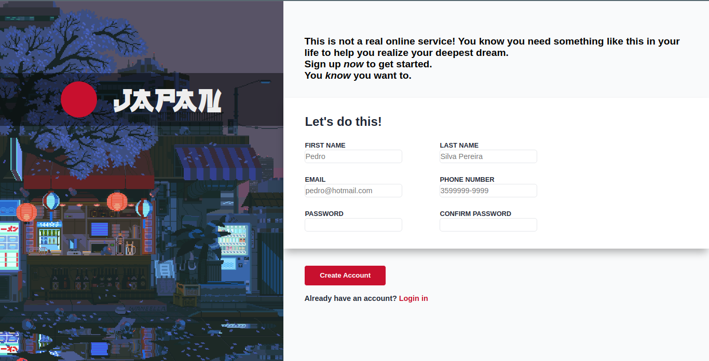

# Forms Project

  <a href="https://joao4xz.github.io/odin_forms/">Live Preview</a>

"The Odin Project" forms project.

This project have the purpose of using forms, inputs, input validation, basics of responsive desing and all of the other things learned before (HTML, CSS and basics of JS).
